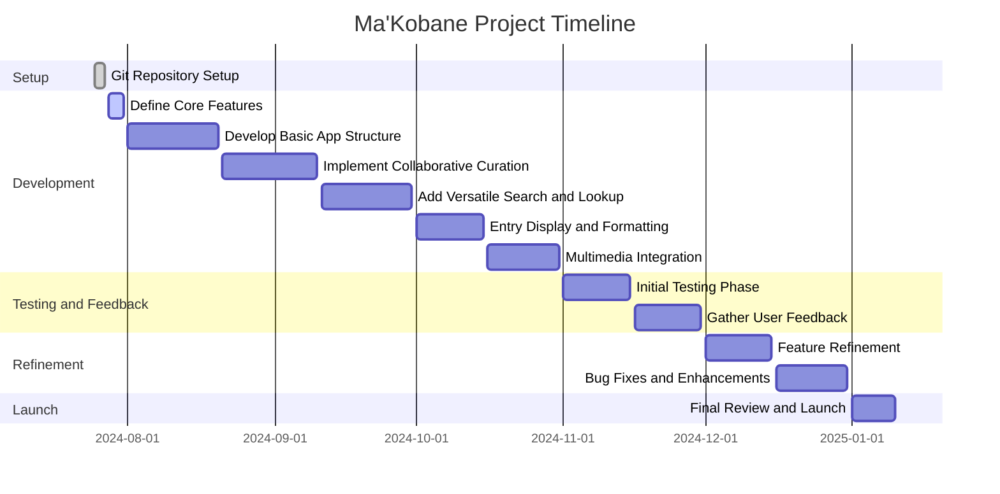

# Ma'Kobane: A Collaborative Sotho to English Dictionary App

## Description

Ma'Kobane is an open-source project dedicated to creating a comprehensive and collaborative Sotho to English dictionary application. The project aims to preserve and promote the Sotho language, an integral part of the cultural heritage of the Basotho people.

The dictionary app is designed to be user-friendly and accessible, catering to both language learners and native Sotho speakers. By leveraging community participation and input, Ma'Kobane will evolve into a dynamic, living resource that extends beyond the traditional dictionary format.

## Key Features

- **Collaborative Entry Curation**: Users can contribute new words, definitions, and examples, with a community voting system ensuring quality and accuracy.
- **Versatile Search and Lookup**: Offers stem-based and full-word search options, including a "fuzzy search" feature to account for common spelling variations.
- **Comprehensive Entry Display**: Main entries appear in bold, derived forms in italics, and symbols indicate inflections, alternative forms, and points of junction.
- **Multimedia Integration**: Includes audio pronunciations and usage examples from literature or user submissions.
- **Cultural Context**: Features cultural notes, explanations, and links to related proverbs, idioms, or sayings.
- **Accessibility Features**: Supports text-to-speech for both Sotho and English, optimized for users with visual impairments.

## Contribution Guidelines

We welcome contributions from the Basotho community and language enthusiasts. Whether you're a native Sotho speaker, a linguist, or a developer, there are many ways to get involved:

- Contribute new word entries, definitions, and usage examples.
- Review and validate existing entries.
- Provide feedback and suggestions for app improvements.
- Participate in discussions to help shape the project's direction.
- Contribute to the codebase and assist with app development.

To get started, please refer to the [CONTRIBUTING.md](CONTRIBUTING.md) file for more information on the contribution process and guidelines.

## Project Status and Roadmap

The Ma'Kobane project is currently in the planning stage. We are actively working on defining the core features, data structure, and development roadmap. Your input and participation are crucial to the success of this project.

## Current state and planned progression for the Ma'Kobane project.

### Explanation

- **Setup Section**: This shows the completion of the Git repository setup.
- **Development Section**: Lists upcoming development tasks and their timelines, including defining core features and implementing key app functionalities.
- **Testing and Feedback Section**: Outlines the initial testing phase and the collection of user feedback to inform future improvements.
- **Refinement Section**: Focuses on refining features and fixing bugs based on user feedback.
- **Launch Section**: Marks the timeline for the final review and official launch of the application.

If you're interested in contributing or have any questions, please reach out to the project maintainers or join the discussion forums.
